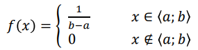
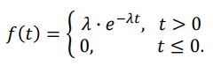
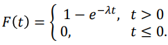
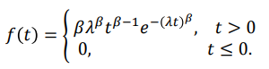
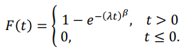
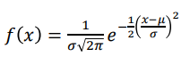
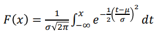

# 13. Vybraná rozdělení diskrétní a spojité náhodné veličiny

## Diskrétní náhodná veličina

- Alternativní rozdělení
- Hypergeometrické rozdělení
- Binomické rozdělení
- Negativně binomické rozdělení
- Geometrické rozdělení
- Poissonovo rozdělen

### Alternativní

Binární rozložení definující pouze to, zda náhodný jev nastal nebo ne.

$X \sim A(\pi)$

$\pi$ = pravděpodobnost úspěchu

| vlastnost                | vzorec                                      |
| ------------------------ | ------------------------------------------- |
| Pravděpodobnostní funkce | $P(X = 1) = \pi$   $P(X = 0) = 1 - \pi$ |
| Střední hodnota          | $E(X) = \pi$                                |
| Rozptyl                  | $D(X) = \pi \cdot (1-\pi)$                  |

> **Příklad**: pravděpodobnost, že hodím kostkou šestku

---

### Hypergeometrické

Definuje pravděpodobobnost úspěchu v _n_ závislých pokusech. V souboru _N_ prvků je _M_ prvků s danou vlastností a zbylých (_N - M_) prvků tuto vlastnost nemá. Postupně vybereme ze souboru _n_ prvků, z nichž žádný nevracíme zpět.

$X \sim {\sf H}(N, M, n)$

_N_ = celkový počet prvků
_M_ = počet prvků s vlastností
_n_ = počet vybraných prvků

| vlastnost                | vzorec                                                         |
| ------------------------ | -------------------------------------------------------------- |
| Pravděpodobnostní funkce | $P(X = k) = \frac{\binom{M}{K}\binom{N-M}{n-k}}{\binom{N}{n}}$ |
| Střední hodnota          | $E(X) = n\cdot\frac{M}{N}$                                     |
| Rozptyl                  | $D(X) = n\cdot\frac{M}{N}(1-\frac{M}{N})(\frac{N-n}{N-1})$     |

> **Příklad**: počet vadných výrobků mezi 10 vybranými z dodávky 30 výrobků

---

### Binomické

Definuje pravděpodobobnost úspěchu v _n_ nezávislých pokusech.

$X \sim {\sf Bi}(n, \pi)$

_n_ = počet pokusů
$\pi$ = pravděpodobnost úspěchu

| vlastnost                | vzorec                                      |
| ------------------------ | ------------------------------------------- |
| Pravděpodobnostní funkce | $P(X = k) = \binom{n}{k}n^{k}(1-\pi)^{n-k}$ |
| Střední hodnota          | $E(X) = n \pi$                              |
| Rozptyl                  | $D(X) = n\pi \cdot (1-\pi)$                 |

> **Příklad**: počet vadných výrobků mezi 30 testovanými, počet dívek/chlapců mezi 100 novorozenci

---

### Negativně binomické

Definuje počet nezávislých pokusů do k. úspěchu (včetně)

$X \sim {\sf NB}(k, \pi)$

_k_ = požadovaný počet úspěchů
$\pi$ = pravděpodobnost úspěchu

| vlastnost                | vzorec                                            |
| ------------------------ | ------------------------------------------------- |
| Pravděpodobnostní funkce | $P(X = n) = \binom{n-1}{k-1}\pi^{k}(1-\pi)^{n-k}$ |
| Střední hodnota          | $E(X) = \frac{k}{\pi}$                            |
| Rozptyl                  | $D(X)= \frac{k(1-\pi)}{\pi^{2}}$                  |

> **Příklad**: Kolk cestujících musím zkontrolovat než najdu 10 černých pasažérů?

---

### Geometrické

Geometrické rozdělení je speciálním typem negativně binomického rozdělení pro 𝑘 = 1.

$X \sim {\sf Ge}(\pi)$

$\pi$ = pravděpodobnost úspěchu

| vlastnost                | vzorec                        |
| ------------------------ | ----------------------------- |
| Pravděpodobnostní funkce | $P(X = n) = \pi(1-\pi)^{n-1}$ |
| Střední hodnota          | $E(X) = \frac{1}{\pi}$        |
| Rozptyl                  | $D(X)= \frac{1-\pi}{\pi^{2}}$ |

> **Příklad**: Kolikrát musím volat do televizní soutěže než se úspěšně dovolám?

---

### Poissonovo

Definuje počet události v omezeném prostoru (objem, čas, plocha).

$X \sim {\sf Po}(\lambda t)$

$\lambda$ = hustota výskytu
_t_ = obecně velikost (plocha, objem, časový interval)

| vlastnost                | vzorec                                              |
| ------------------------ | --------------------------------------------------- | --- | --------------- | ------------------ |
| Pravděpodobnostní funkce | $P(X = k) = \frac{\lambda t^{k}}{k!}e^{-\lambda t}$ |     | Střední hodnota | $E(X) = \lambda t$ |
| Rozptyl                  | $D(X) = \lambda t$                                  |

> **Příklad**: počet pacientů ošetřených během dopoledních ordinačních hodin

---

## Spojitá náhodná veličina

- Rovnoměrné rozdělení
- Exponenciální rozdělení
- Weibullovo rozdělení
- Normální rozdělení
- Normované normální rozdělení

### Rovnoměrné

Jde o rozdělení, jehož hustota pravděpodobnosti je konstantní na nějakém intervalu <a,b> a všude jinde je nulová.

$X \sim  Ro (a, b)$

_a_ = dolní hranice intervalu
_b_ = horní hranice itnervalu

| vlastnost                | vzorec                                      |
| ------------------------ | ------------------------------------------- |
| Hustota pravděpodobnosti |  |
| Střední hodnota          | $E(X) = \frac{a + b}{2}$                    |
| Rozptyl                  | $D(X) = \frac{(a - b)^{2}}{12}$             |

> **Příklad**: čekání na tramvaj

---

### Exponenciální

Délka časových intervalů mezi událostmi v Poissonově procesu.

$X \sim Exp (\lambda)$

$\lambda$ = hustota výskytu

| vlastnost                | vzorec                                       |
| ------------------------ | -------------------------------------------- |
| Hustota pravděpodobnosti |  |
| Distribuční funkce       |    |
| Střední hodnota          | $E(X) = \frac{1}{\lambda}$                   |
| Rozptyl                  | $D(X) = \frac{1}{\lambda^{2}}$               |

> **Příklad**: doba do poruchy zařízení

---

### Weibullovo

$X \sim Wb(\frac{1}{\lambda}, \beta)$

$\lambda$ = hustota výskytu
$\beta$ = parametr tvaru

| vlastnost                | vzorec                                      |
| ------------------------ | ------------------------------------------- |
| Hustota pravděpodobnosti |  |
| Distribuční funkce       |    |

> **Příklad**: Doba přežití pacienta

---

### Normální rozdělení

Popisuje náhodné veličiny, jejichž hodnoty se symetricky shlukují kolem střední hodnoty a vytvářejí tak charakteristický tvar hustoty pravděpodobnosti známý pod názvem Gaussova křivka.

$X \sim {N}(\mu, \sigma^{2})$

$\mu$ = střední hodnota

$\sigma^{2}$ = rozptyl

| vlastnost                | vzorec                                        |
| ------------------------ | --------------------------------------------- |
| Hustota pravděpodobnosti |  |
| Distribuční funkce       |    |

**normované normální rozdělení**:

$X \sim {N}(\mu = 0, \sigma^{2} = 1)$

**Pravidlo $3\sigma$**

Toto pravidlo nám říká kolik procent hodnot je v _k_ násobku směrodatné odchylky od průměru.

| k   | $P(\mu - k\sigma < X < \mu + k\sigma)$ |
| --- | -------------------------------------- |
| 1   | 0.682 (68%)                            |
| 2   | 0.954 (95%)                            |
| 3   | 0.997 (97%)                            |
