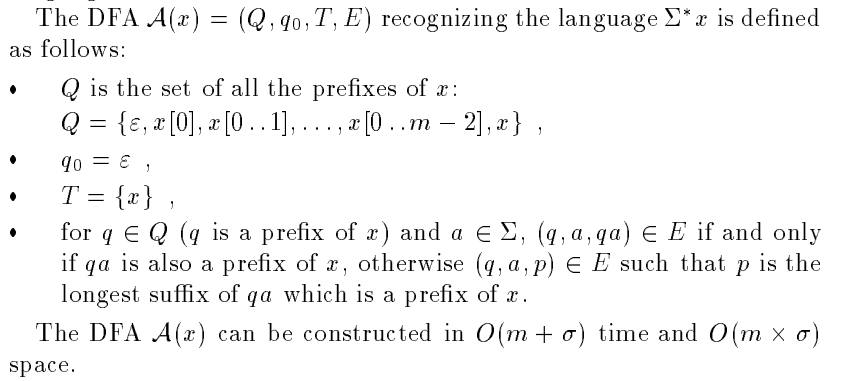
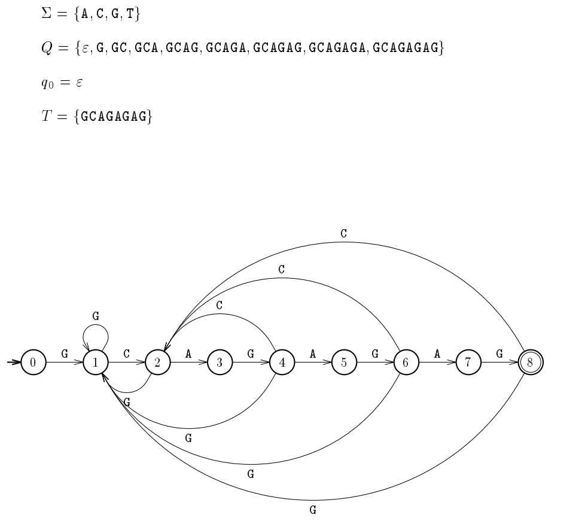

# 18. Algoritmy pro pattern matching (Vyhledávání jednoho vzorku, více vzorků; Vyhledávání regulárních výrazů; Přibližné vyhledávání)
Pattern matching je vyhledávání vzorů v textu. Můžeme vyhledávat přesné vzory v textu, nebo přibližné vzory například pokud hledaný vzor obsahuje chybu.
Vzor (pattern) i text jsou poskládány z konečné množiny znaku tzv. abecedy. Abeceda se označuje jako $\Sigma$ a délka abesedy jako $\sigma$. Algoritmy se různí podle toho zdali byl prvdí podán vzor nebo text.
Pokud se první zpracováva vzor tak se tento vzor předzpracuje aby bylo možné ho rychle v textu vyhledávat.

## Vyhledávání jednoho vzorku, více vzorků

### Algoritmus hrubou silou (Brute force algorithm)
Hlavní vlastnosti
- nevyžaduje předzpracování
- vždy se posunuje přesně 1 krok do prava
- porovnání může probíhat v libovolném pořadí
- vyhledavací fáze má $O(m \times n)$ časovou složitost
- $2n$ očekávaných textových porovnání znaků

Jednoduše se porovnává každý znak s každým znakem, pokud se znak vzoru rovná znaku v textu probněhne posun a kontroluje se druhý znak. Pokud se znak vzoru nerovná znaku v textu tak se začne porovnávat první znak vzorou.

### Deterministický konečný automat (Search with an automaton)
Hlavní vlastnosti 
- vytvoří minimální deterministický konečný automat který rozpozná jazyk $\Sigma^* x$
- extra prostor $O(m \times \sigma)$ jestli je automat uložen v tabulce přímeho přístupu
- část předzpracování má $O(m \times \sigma)$ časové složitosti
- vyhledavací fáze má složitost $O(n)$ jestli je uložen v tabulce přímeho přístupu a jinak $O(n \times \log{\sigma})$

Nejdříve se vytvoří minimální deterministický automat. Poté se prochází text po jednotlivých znacích a pokaždé co je dosažen konečný stav tak se uloží pozice nalezeného vzoru.

