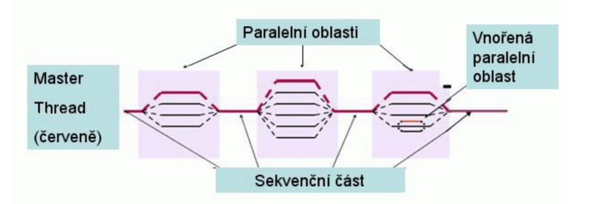

# 23. Systémy se sdílenou a distribuovanou pamětí: komunikace mezi procesy (souběh, uváznutí, vzájemné vyloučení). Komunikace pomocí zasílání zpráv. OpenMP, MPI.

Souběžný přístup ke sdíleným datům může způsobit jejich nekonzistenci. Proto je nutná koordinace procesů.

## Souběh
Vzniká v případě, kdy dva nebo více procesů modifikuje stejná data. Pokud by procesy byly spuštěny samostatně, k
problému by nedošlo. Může nastat v různých situacíh: práce s daty OS, přístup ke společným souborům přes síť

Řešení souběhu - atomické operace, zamykání.

Semafory - do kritické části programu nejde vpustit více procesů současně, to je hlídáno semaforem který
inkrementujeme a dekrementujeme při vstupu/opuštění sekce.

Pasivní čekání - řešíme frontou procesů před kritickou sekcí

## Uváznutí (deadlock)
Dva nebo více procesů čeká na událost, ke které by došlo jen pokud by jeden z nich mohl pokračovat (čekají na sebe).
Je možná detekce uváznutí a čekání ukončí buď OS nebo správce.

Řešení uváznutí - ignorace, předcházení, vyhýbání se uváznutí (systém zjišťuje zda přidělením nezpůsobí), detekce a
zotavení

## Vzájemné vyloučení (mutual exclusion, mutex)
Synchronizační prostředek zabraňující současnému vykonávání dvou nebo více kritických kódů nad stejným sdíleným
prostředkem. Kritický kód je část kódu, ve které proces nebo vlákno přistupuje k veřejným prostředkům. Pokud jeden
proces vstoupil do kritického kódu a nedokončil poslední instrukci, nemůže nad tímto prostředkem žádný jiný proces
vstoupit do kritického kódu.

## OpenMP
Soustava direktiv pro překladač a knihovních procedur pro paralelní programování. Standard programování počítačů se
sdílenou pamětí. Usnadňuje vytváření vícevláknových programů v programovacích jazycích Fortran, C a C++.

OpenMP se spouští pomocí tzv. direktiv. K vytvoření skupiny vláken použijeme direktivu pragma:

    #pragma omp parallel
    {
    ... // každé vlákno vykonává příkazy tohoto bloku
    }
    
K rozdělení práce cyklu mezi vlákna použijeme:
    
    #pragma omp parallel for
    for (i=0; i<N; i++) {
    ... // každé vlákno vykoná část iterací
    }
    

## OpenMPI (Message passing interface)
Knihovna pro paralelní výpočty. Používá ho spousta superpočítačů z TOP500 supercomputers. Jde o sloučení tří
nejznámějších MPI implementací (FT-MPI, LA-MPI, LAM/MPI). Skládá se z OMPI (MPI kód), ORTE (Open Run-Time
Environment) a OPAL (Open Portable Access Layer).
